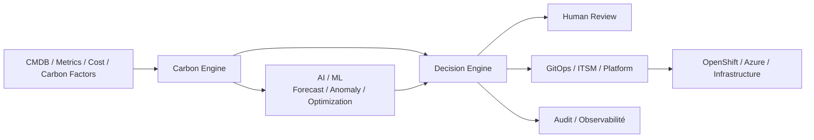
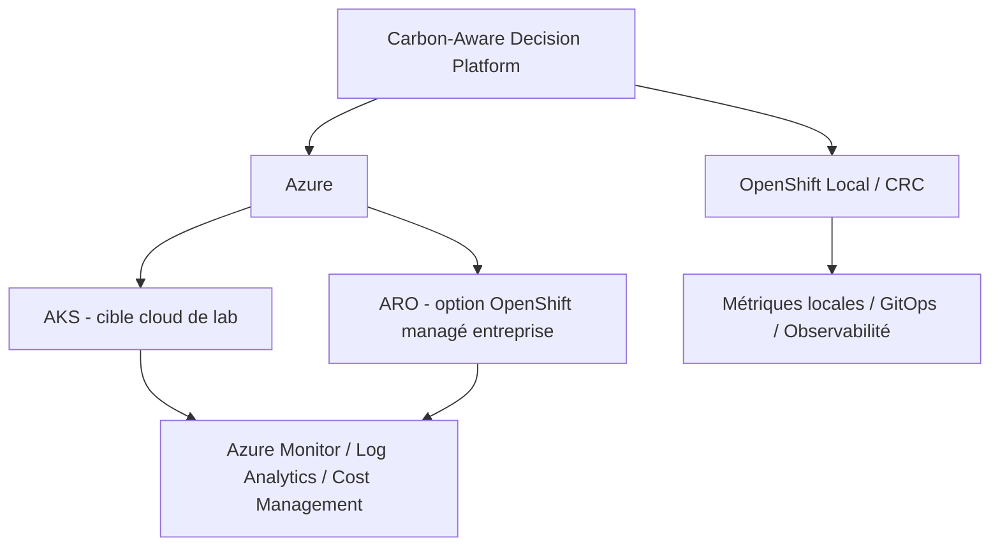

# Architecture initiale — MayaBank Carbon-Aware Payment Platform

## Vue logique

## Responsabilités

- **Sources** : inventaire, métriques, coûts, facteurs carbone et criticité.
- **Carbon Engine** : calculs reproductibles et scénarios AS-IS / TO-BE.
- **AI/ML** : prévision de charge, anomalies, classement et optimisation multi-critères.
- **Decision Engine** : appliquer politiques Green IT, SLA, RTO/RPO, sécurité, budget et criticité.
- **Human Review** : valider les changements sensibles ou à forte incertitude.
- **GitOps / ITSM** : exécuter uniquement les changements approuvés.
- **Audit/Observabilité** : conserver sources, hypothèses, modèle, règle et décision.

## Types de décisions cibles

- MIGRATE ;
- RIGHTSIZE ;
- CONSOLIDATE ;
- KEEP ;
- RETIRE ;
- REVIEW.

## Principe de gouvernance

Une recommandation AI n’est pas une décision d’exploitation. La décision finale doit pouvoir expliquer les données utilisées, les hypothèses, les règles, le niveau de confiance et les contraintes qui ont conduit au résultat.

## Architecture de déploiement

### OpenShift Local / CRC

Cible prioritaire pour tester localement le Carbon Engine, les API, l’AI/ML, le Decision Engine, l’observabilité et les scénarios GreenOps avec des données synthétiques.

### Azure

- **AKS** : cible Kubernetes Azure de référence pour reproduire les scénarios dans le cloud.
- **ARO** : option entreprise lorsque l’architecture cible impose OpenShift managé sur Azure.
- Azure Monitor, Log Analytics et Cost Management seront intégrés progressivement comme sources cloud lorsque les itérations correspondantes seront exécutées.

La logique Carbon/AI/Decision reste identique entre local et Azure. Les différences sont limitées aux connecteurs, manifests, overlays, secrets et IaC.

## Cible d’industrialisation

OpenShift Local / CRC pour les preuves locales, puis Azure AKS pour les validations cloud, avec ARO comme alternative entreprise. Les prochaines itérations ajouteront modèle carbone, API, événements, GitOps, ITSM, FinOps/GreenOps, sécurité, audit et tests avant/après.
