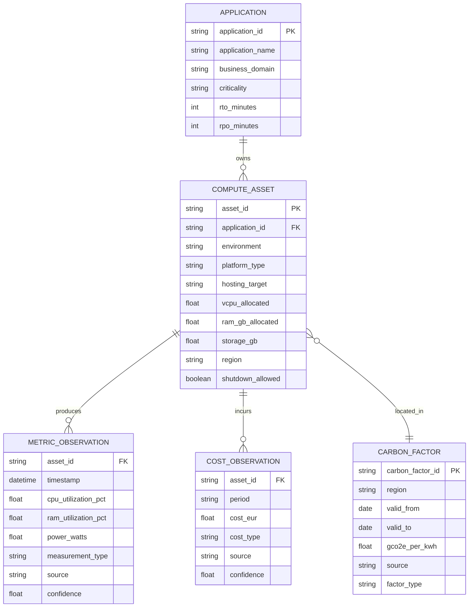

# Architecture de données — Itération 1

## Lecture architecturale

1. L’**application** porte la criticité et les objectifs RTO/RPO.
2. Un ou plusieurs **actifs techniques** supportent l’application.
3. Les **métriques** sont temporelles et ne sont jamais confondues avec la capacité allouée.
4. Les **coûts** sont historisés par période.
5. Les **facteurs carbone** sont versionnés par région et période de validité.
6. Toute future recommandation devra conserver la provenance et le niveau de confiance des données utilisées.

## Préparation des itérations suivantes

Ce modèle permettra ensuite de calculer :

- taux de sous-utilisation ;
- énergie estimée ;
- empreinte carbone par actif/application ;
- coût par actif/application ;
- scénarios de right-sizing ;
- scénarios AS-IS / TO-BE OpenShift ;
- recommandations multi-critères Carbon + FinOps + résilience.
